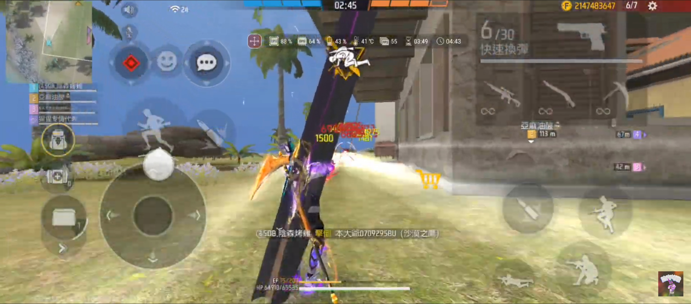
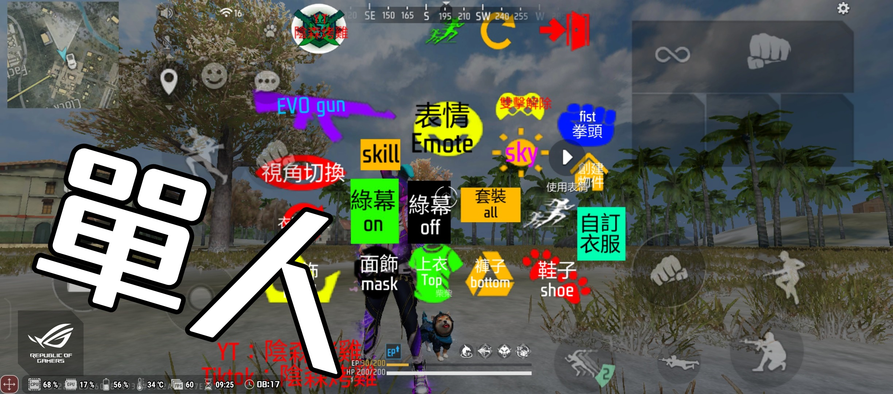
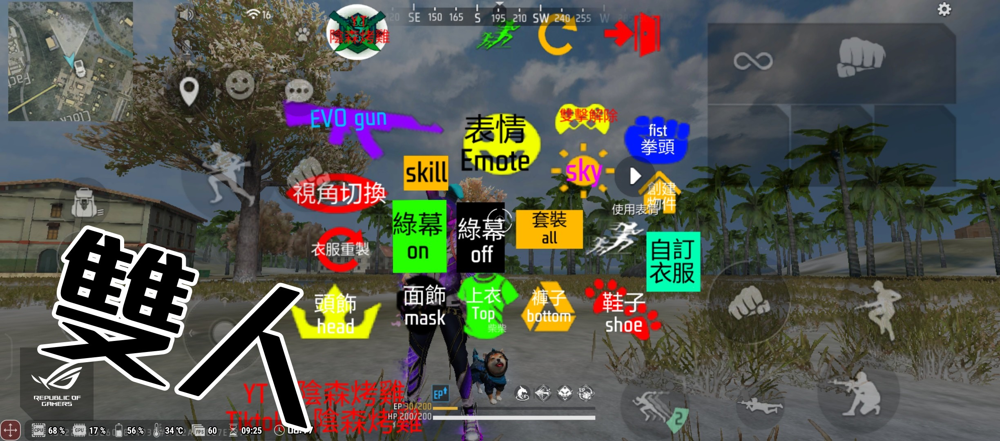
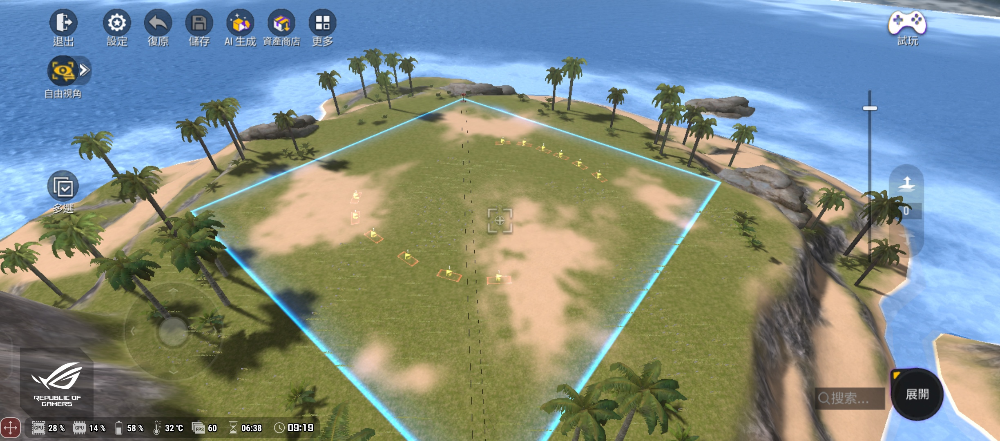
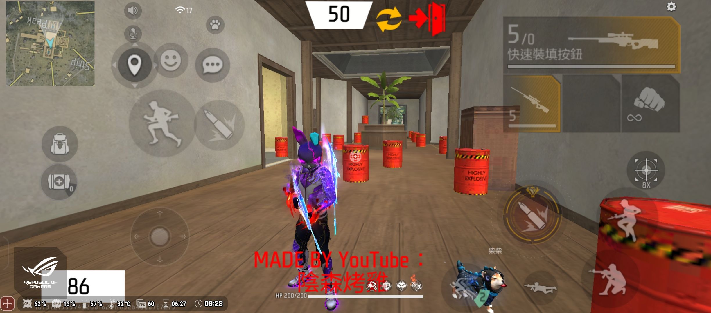
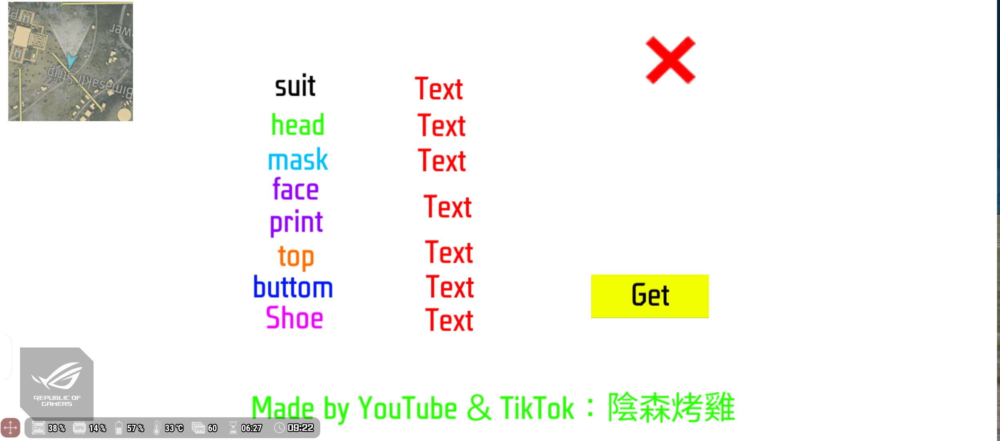
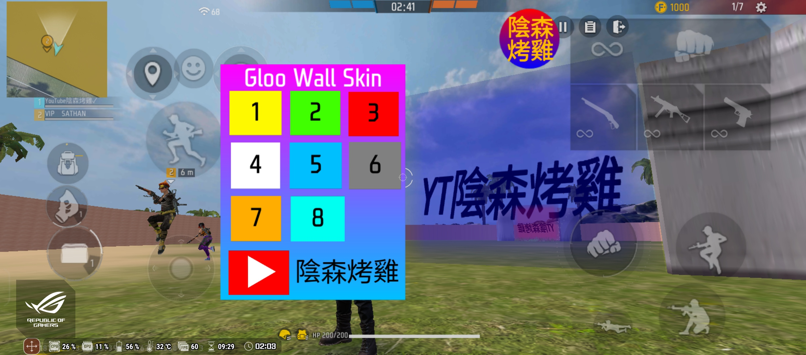

<!DOCTYPE html>
<html lang="en">
<head>
    <meta charset="UTF-8">
    <meta name="viewport" content="width=device-width, initial-scale=1.0">
    <title>戰場地圖代碼</title>
    
</head>
<body>
    

        

        

        

    

    

        <a href="https://iscg-yt.github.io">
1.Map code
</a>
        <a href="https://linktr.ee/ff.cg">
2. All social medias
</a>
        <a href="https://forms.zohopublic.com/sobrickffgm1/form/Playersmaprecommend/formperma/lsD3viLptVn5sEEwdmRBHRpsjEWC7ZF-q0gihbwDW7k">
3. Players map recommend（問卷）
</a>
        <a href="https://linktr.ee/ff.cg">
4. Players map recommend（地圖）
</a>
    

    

        <input type="text" id="searchInput" placeholder="搜尋關鍵字...">
        <button onclick="filterSections()">搜尋</button>
    

    

        <h1>[b]我的戰場地圖代碼</h1>
        <!-- Section 1 -->
        

            <h1>所有進化武器體驗</h1>
            
            
#FREEFIREC55A6330CE58EB61C8E3C975B8E90D8F9815

            <button class="copy-btn" onclick="copyText('text1')">複製代碼</button>
        

        <!-- Section 2 -->
        

            <h1>外掛體驗！</h1>
            
            
#FREEFIRED796B3438F1B31DDE1814CA8A851491A9815

            <button class="copy-btn" onclick="copyText('text2')">複製代碼</button>
        

        <!-- Section 3 -->
        

            <h1>單人-全進化槍+衣服</h1>
            
            
#FREEFIRECC6698AD72FE062B3D8E4D9463D61CDD9815

            <button class="copy-btn" onclick="copyText('text3')">複製代碼</button>
        

        <!-- Section 4 -->
        

            <h1>雙人-全進化槍+衣服</h1>
            
            
#FREEFIREDF3E35BEF841A8858646FC70F227CC6F9815

            <button class="copy-btn" onclick="copyText('text4')">複製代碼</button>
        

        <!-- Section 5 -->
        

            <h1>自動去塗裝地圖（裕隆規用）</h1>
            
            
#FREEFIRE64F58476D76F49441A1B9FA0600547229815

            <button class="copy-btn" onclick="copyText('text5')">複製代碼</button>
        

        <!-- Section 6 -->
        

            <h1>取得服裝ID</h1>
            
            
#FREEFIREC77E5B663EBB33602FD4C8074A86A8B79815

            <button class="copy-btn" onclick="copyText('text6')">複製代碼</button>
        

        <!-- Section 7 -->
        

            <h1>單人-狙擊訓練場</h1>
            
            
#FREEFIRE99929B54F0C8CDABAD54FF2157E51FC49815

            <button class="copy-btn" onclick="copyText('text7')">複製代碼</button>
        

        <!-- Section 8 -->
        

            <h1>雙人合作跑酷</h1>
            
            
#FREEFIREBDDA32692D1DFB97BF2CD77842895A4B9815

            <button class="copy-btn" onclick="copyText('text8')">複製代碼</button>
        

        <!-- Section 9 -->
        

            <h1>凝膠塗裝體驗</h1>
            
            
#FREEFIREA56D6F07C155F825F63CCD7BA50871219815

            <button class="copy-btn" onclick="copyText('text9')">複製代碼</button>
        

    
</body>
</html>
